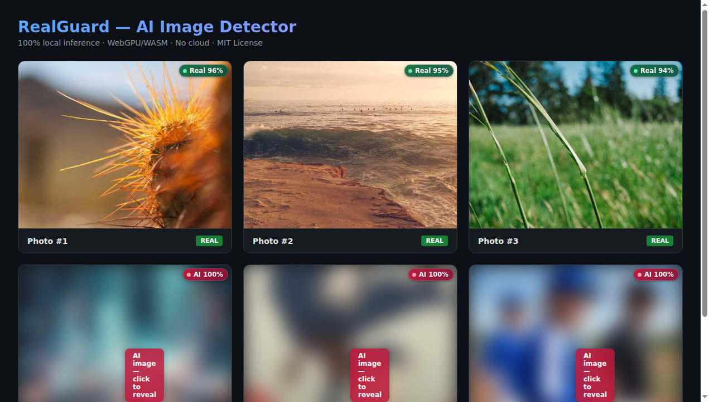

# RealGuard — AI Image Detector for Chrome, 100% on-device

<p align="center">
  <strong>Detect AI-generated images as you browse — all inference runs locally in your browser.</strong>
</p>

<p align="center">
  <a href="./LICENSE">MIT License</a> ·
  <a href="./docs/MODEL.md">Model Evidence</a> ·
  <a href="./docs/PRIVACY.md">Privacy</a> ·
  <a href="./docs/SECURITY.md">Security</a> ·
  <a href="./COMPLIANCE.md">Compliance</a>
</p>

---

## What it does

RealGuard scans every image on the pages you browse and pins a confidence
score on each one — **without sending a single pixel to the cloud**. The entire
detection pipeline (model download, preprocessing, inference, metadata
forensics, frequency analysis) runs inside a Chrome Extension MV3 with
WebGPU/WASM.

| Feature | Detail |
|---------|--------|
| **Model** | [CommunityForensics ViT-S/16 @384](https://huggingface.co/buildborderless/CommunityForensics-DeepfakeDet-ViT) — 21.8M params, trained on 2.7M samples from 4,803 generators (CVPR 2025) |
| **Inference** | ONNX Runtime Web direct (`.bundle` build), WebGPU primary with WASM fallback |
| **Pipeline** | 5-signal fusion: neural classifier + frequency-domain analysis + C2PA/metadata forensics + EXIF/XMP/IPTC signals + Platt calibration |
| **Preprocessing** | Custom Pillow-matching bilinear resize (not browser canvas resampling) |
| **Architecture** | Offscreen document pattern — inference survives service-worker teardowns |
| **Privacy** | No telemetry, no cloud, no remote code. Images never leave the device. |
| **License** | MIT (code, model, and runtime) |

## Detection signals

RealGuard combines five independent signals rather than relying on a single
classifier:

1. **Neural classifier** — ViT-S/16 fine-tuned on 4,803 AI generators. Outputs
   a logit → sigmoid → `p(fake)`.
2. **Frequency-domain analysis** — Laplacian high-pass filter detects "too
   smooth" regions characteristic of AI generation. Only nudges in the uncertain
   zone [0.3–0.7], max ±0.05.
3. **C2PA / JUMBF manifests** — Signed provenance manifests from Adobe C2PA.
   Hard evidence → clamps to ≥0.97.
4. **Metadata forensics** — Scans PNG `tEXt`/`iTXt` chunks (Stable Diffusion
   parameters, ComfyUI workflow, NovelAI tags), JPEG EXIF (Software tag, camera
   MakerNote), XMP (IPTC `digitalSourceType`), WebP RIFF. 35+ generator markers.
5. **Platt calibration** — Sigmoid scaling `σ(a·logit + b)` maps raw logits to
   calibrated probabilities. Fitted on a 110-image benchmark (a=0.5, b=2.9),
   improving balanced accuracy from 80.83% to 88.33%.

## Install

### From source (reproducible build)

```bash
git clone https://github.com/buildborderless/realguard.git
cd realguard
npm install
npm run build
```

Then load the extension:

1. Open `chrome://extensions`
2. Enable **Developer mode**
3. Click **Load unpacked**
4. Select the `extension/dist/` folder

The model (87 MB) downloads automatically on first use from HuggingFace and is
cached in the browser's Cache Storage. After that, the extension works fully
offline.

### Build options

```bash
npm run build          # Build extension
npm test               # Run unit tests (27 tests)
```

## How it works

```
┌─────────────┐     ┌──────────────────┐     ┌─────────────────────┐
│  content.js │────▶│  background.js   │────▶│   offscreen.js      │
│  (per-tab)  │     │  (service worker) │     │   (inference host)  │
│             │◀────│  cache, routing   │◀────│                     │
│  • discover │     │  dedup, context   │     │  engine.js          │
│  • badge    │     │  menu             │     │  ├── ONNX session   │
│  • blur AI  │     │                  │     │  ├── preprocess()   │
│  • heatmap  │     │                  │     │  ├── meta.js        │
│  • panel    │     │                  │     │  ├── freq.js        │
└─────────────┘     └──────────────────┘     └─────────────────────┘
```

- **Content script** discovers `` elements (including shadow DOM, CSS
  backgrounds, iframes), renders Shadow DOM badges, auto-blurs AI images, and
  provides a hover forensics panel + 3×3 heatmap.
- **Service worker** manages the offscreen document lifecycle, caches results
  (LRU, 750 entries), deduplicates concurrent requests, and routes context-menu
  commands.
- **Offscreen document** hosts the ONNX inference session — survives
  service-worker teardowns and has a stable WebGPU/WASM context.

## Reproducibility

| Component | Pinned to | Verification |
|-----------|-----------|-------------|
| Model weights | `buildborderless/CommunityForensics-DeepfakeDet-ViT` `onnx/model.onnx` | SHA-256 `a42c7d74…a8ba1` |
| ONNX Runtime | `onnxruntime-web@1.21.0` (npm lockfile) | `package-lock.json` |
| WASM binary | `ort-wasm-simd-threaded.jsep.wasm` (23.9 MB) | Bundled in `vendor/ort/` |
| Build | esbuild 0.25.0, deterministic | `npm ci && npm run build` |

## Testing

### Unit tests

```bash
npm test
```

27 tests covering metadata signal extraction (C2PA, EXIF, PNG, XMP) and
frequency-domain analysis (DCT, block energy, fusion rules).

### E2E browser test

```bash
node e2e/extension-test.mjs
```

Loads the built extension in a headless Chromium, navigates to a test page with
known real and AI images, and verifies badge rendering + classification results.

### Forensics Lab

Open the popup → **Forensics Lab**, then drag a folder containing `real/` and
`ai/` subfolders to evaluate balanced accuracy on your own dataset.

## Evaluation

See [`docs/evaluation.json`](./docs/evaluation.json) and
[`docs/MODEL.md`](./docs/MODEL.md) for detailed results.



Independent benchmark (110 images, through the real extension pipeline):

| Metric | Raw sigmoid | With calibration |
|---|---|---|
| **Balanced accuracy** | 80.83% | **88.33%** |
| TPR (AI recall) | 61.67% | 86.67% |
| TNR (real recall) | 100% | 90.00% |

Per-generator accuracy (calibrated, threshold 0.65):

| Generator | Accuracy |
|---|---|
| DALL-E 3 | 100% (15/15) |
| FLUX / SD3 | 100% (10/10) |
| Ideogram | 100% (10/10) |
| Midjourney | 80% (12/15) |
| GPT-4o | 50% (5/10) |

> **Disclaimer:** Public results do not guarantee the private bounty
> evaluation result. Calibration was fitted on this dataset and may
> overfit. GPT-4o images are the hardest case.

## Project structure

```
realguard/
├── extension/
│   ├── manifest.json          # MV3 manifest
│   ├── src/
│   │   ├── background.js      # Service worker (routing, cache, offscreen mgr)
│   │   ├── content.js         # Content script (badges, blur, heatmap, panel)
│   │   ├── offscreen.js       # Offscreen doc host (ONNX inference)
│   │   ├── popup.js           # Popup UI logic
│   │   ├── lab.js             # Forensics Lab evaluation UI
│   │   └── lib/
│   │       ├── engine.js      # ONNX session, preprocess, analyze, explain
│   │       ├── meta.js        # Metadata forensics (C2PA, EXIF, XMP, PNG)
│   │       └── freq.js        # Frequency-domain analysis (DCT, Laplacian)
│   └── static/
│       ├── models.json        # Model config + calibration + SHA-256
│       ├── popup.html
│       ├── offscreen.html
│       ├── lab.html
│       └── content.css
├── tests/                     # Unit tests (meta.test.mjs, freq.test.mjs)
├── e2e/                       # E2E browser test
├── eval/
│   ├── calibrate.py           # Platt scaling calibration fitter
│   └── (data/)                # Evaluation datasets (gitignored)
├── tools/
│   └── bench.mjs              # Batch benchmark harness
├── docs/
│   ├── MODEL.md               # Model evidence + evaluation
│   ├── evaluation.json        # Machine-readable results
│   ├── PRIVACY.md             # Privacy policy
│   └── SECURITY.md            # Security policy
├── .github/workflows/ci.yml   # CI: build + test
├── build.mjs                  # esbuild bundling + asset copy
├── COMPLIANCE.md              # Bounty compliance matrix
├── THIRD_PARTY_NOTICES.md     # Third-party license attribution
├── SECURITY.md                # Security policy (root)
├── LICENSE                    # MIT
└── README.md
```

## Bounty compliance

This extension is built for [POIDH Bounty #323](https://poidh.xyz/arbitrum/bounty/323):
"local AI challenge: AI image detector for Chrome."

See [`COMPLIANCE.md`](./COMPLIANCE.md) for the full requirement matrix.

## License

MIT — see [`LICENSE`](./LICENSE). Third-party attributions in
[`THIRD_PARTY_NOTICES.md`](./THIRD_PARTY_NOTICES.md).
